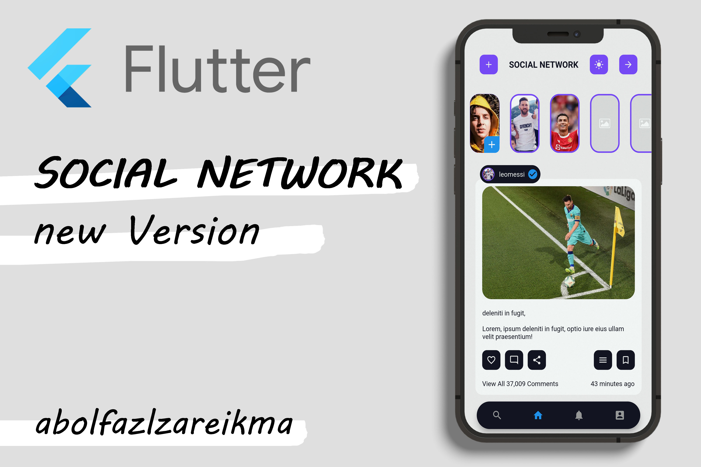
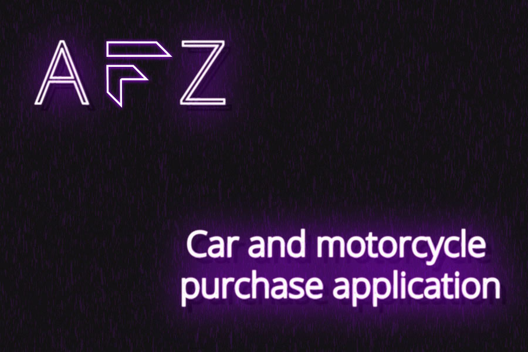
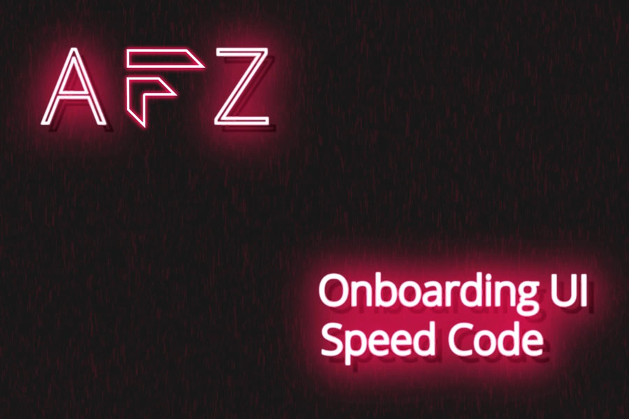
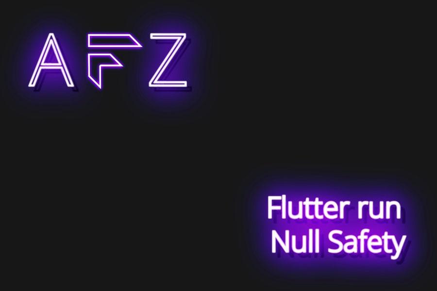

<html>
  <body>
  
 
    <h1> Social Network New Version </h1>
    <h2> Light Mode </h2>
    
    <h2> Dark Mode </h2>
    
     
    <h1> Packages </h1>
    <h3> custom_navigation_bar: </h3>
    <h3> flutter_staggered_grid_view: </h3>
    <h3> flutter_switch: </h3>
    <h3> get: </h3>
    <h3> flutter_staggered_animations: </h3>
    <h3> shimmer_animation: </h3>
    
  

    </body>
  </html>

Flutter - Social Network New Version
 
  
Flutter - Multi language application with GetX
 

 
Flutter - Read Local JSON File From assets folder
 

 
[Flutter - Car and motorcycle purchase application](https://github.com/abolfazlzareikma/afz-car-motorcycle)
 

 
Flutter - Onboarding Screen
 

 
Flutter - Run Null Safety In Android Studio
 

